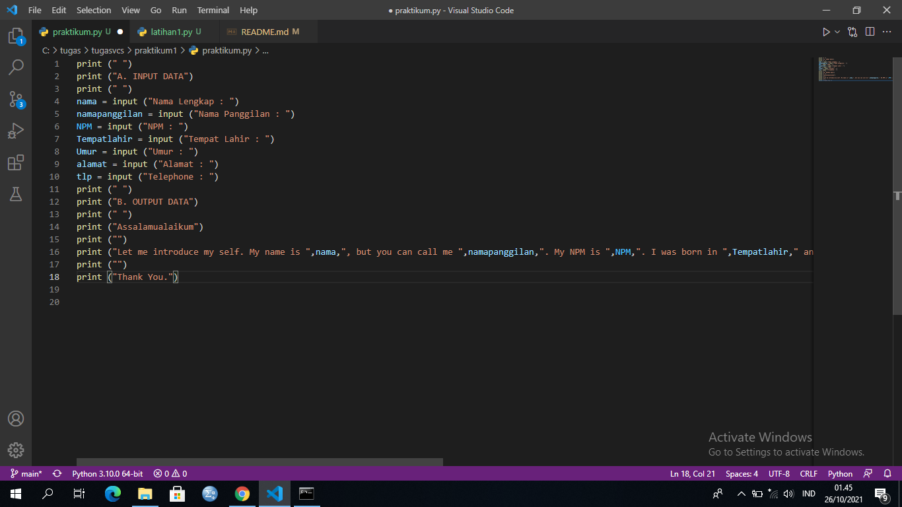
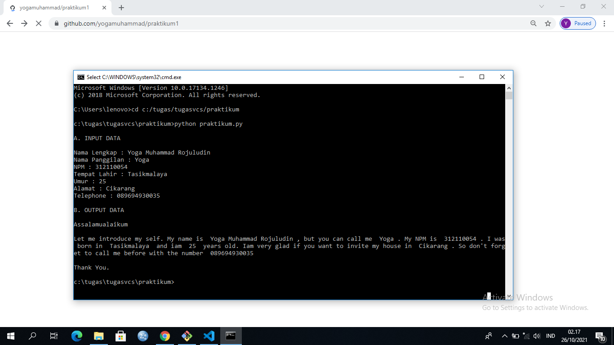

# praktikum1

## PYTHON

## A. INPUT
## adalah masukan yang kita berikan ke program. Program akan memprosesnya dan menampilkan hasil outputnya.
## cara membuat input nya seperti ini :
## nama_variabel = input("sebuah teks)
## artinya teks yang kita inputkan akan disampaikan ke #nama_variabel.

## B. OUTPUT
## adalah hasil dari input.
## cara menampilkan output nya seperti ini :
## print(nama_variabel)

